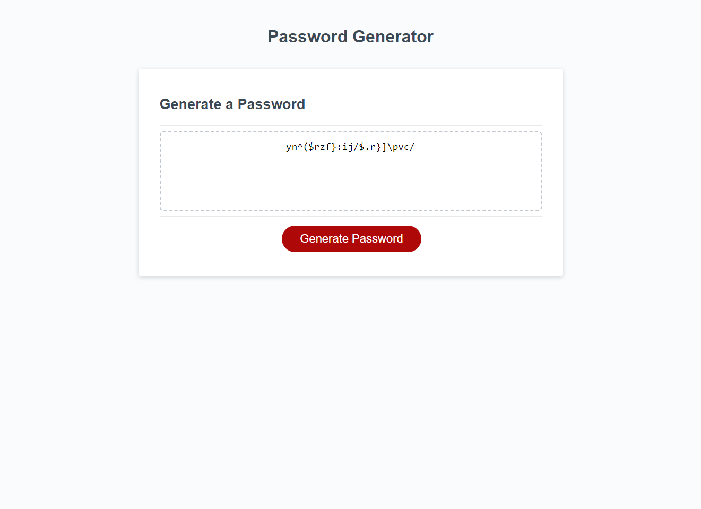

# Password Generator Application

## Description

This project is created for generating a random password using all the conditions set by the user.

The application prompts the user with various options that needs to be selected by the user, which will help in setting the conditions for the password. 

User selects from the following options:

* Total length of the password. Length has to be chosen within a range of 10 and 64.

* Can we include Upper Case, Lower Case, Numeric, and Special characters. Atleast one of these options must be chosen.

Using the selected options and password length, the application generates a password and displays it on the web page.

## Installation

The application can be accessed at the following website:

https://jayapk21.github.io/Password-Generator/

## Usage

After accessing the website, click on the 'Generate Password' button to start generating a password. A list of prompts follows to get conditions on which the password has to be generated. On successfully answering the prompts, the password is displayed on the web page. 

The following screenshot shows an example of a generated password, which includes only lowercase and special characters. The password length is specified as 23.

